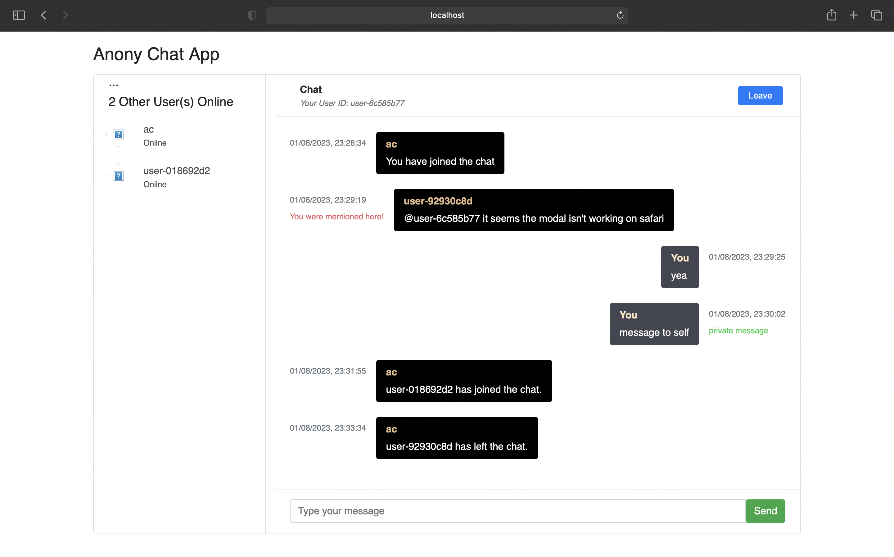

# anony-chat
<div align="center">
  <h3 align="center">Anonymous Real-Time Messaging Chat Platform</h3>

  <p align="center">
    Chat with strangers anonymously.
    <br />
    <a href="https://chatty-5o1n.onrender.com">View Demo</a>
  </p>
</div>


<!-- TABLE OF CONTENTS -->
<details>
  <summary>Table of Contents</summary>
  <ol>
    <li>
      <a href="#about-the-project">About The Project</a>
      <ul>
        <li><a href="#endpoints">API Endpoints</a></li>
        <li><a href="#built-with">Built With</a></li>
      </ul>
    </li>
    <li>
      <a href="#getting-started">Getting Started</a>
      <ul>
        <li><a href="#prerequisites">Prerequisites</a></li>
        <li><a href="#installation">Installation</a></li>
      </ul>
    </li>
    <li><a href="#usage">Usage</a></li>
    <li><a href="#license">License</a></li>
  </ol>
</details>


<!-- ABOUT THE PROJECT -->
## About The Project
A real-time messaging platform for chatting anonymously:

### Given requirements 
* A user can create an account
* A user login into their account
* A user can chat with other online users in real-time via websockets

### Built With
* Go
* PostgreSQL
* Websocket
* Vanilla JS
* Postman


### API Swagger Docs
[https://chatty-5o1n.onrender.com/docs](https://chatty-5o1n.onrender.com/docs)

  
### Endpoints:

#### Create an account

`POST /api/v1/auth/signup`

Example request body:

```source-json
{
    "email": "test.user@gmail.com",
    "password": "HelloMrWsa@88",
    "confirmPassword": "HelloMrWsa@88"
}
```

Required fields: `email`, `password`, `confirmPassword`


#### Login into an account

`POST /api/v1/auth/login`

Example request body:

```source-json
{
    "email": "test.user@gmail.com",
    "password": "HelloMrWsa@88"
}
```

Required fields: `email`, `password`


#### Websocket connection Url

`WS /ws/chat?auth_token=token_here`

Required query param: `auth_token`


### HTTP Response Status codes:

* 200 for OK
* 201 for new user account successfully created
* 400 for Bad requests
* 401 Unauthorized
* 404 for Not found requests, when a resource can't be found to fulfill the request
* 409 for conflicting requests
* 500 for Internal Server Error

<p align="right">(<a href="#readme-top">back to top</a>)</p>


<!-- GETTING STARTED -->
## Getting Started

### Prerequisites

* To run this project, make sure you have Go and PostgreSQL installed on your machine.

### Installation

1. Clone the repo
   ```sh
   git clone https://github.com/rafmme/anony-chat.git
   ```
2. Rename the `.env.sample` file to `.env` and populate the variables with the right data
   ```
    PORT="6777"
    DB_HOST="127.0.0.1"
    DB_PORT="5432"
    DB_NAME="chatapp"
    DB_USER="user"
    DB_PASSWORD="password"
    SECRET_KEY="KeepAtItBoy!"
    BOT_KEY="xssduifgATA4qwer6078-99y7654wsxghcvr5rfvhvmgcvv"
   ```

3. Run this command ```make run``` or ```make start``` to start up the application.

<p align="right">(<a href="#readme-top">back to top</a>)</p>


<!-- USAGE EXAMPLES -->
## Usage

<div style="text-align:center">
    
</div>

<p align="right">(<a href="#readme-top">back to top</a>)</p>

<!-- LICENSE -->
## License

Distributed under the MIT License. See `LICENSE.txt` for more information.

<p align="right">(<a href="#readme-top">back to top</a>)</p>

